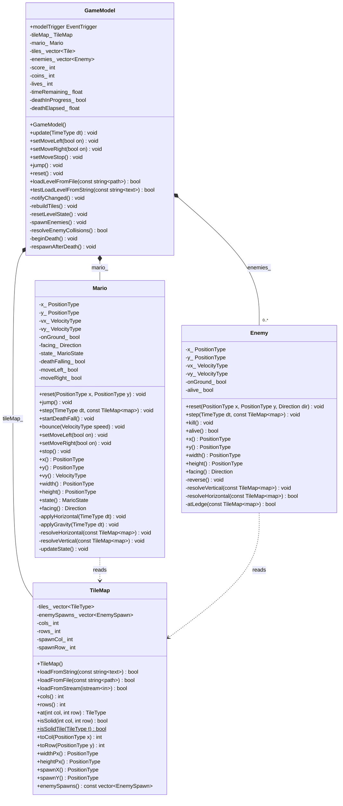
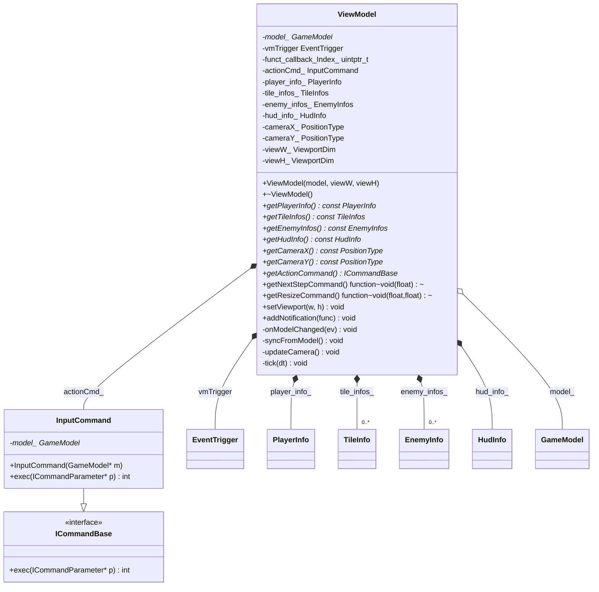
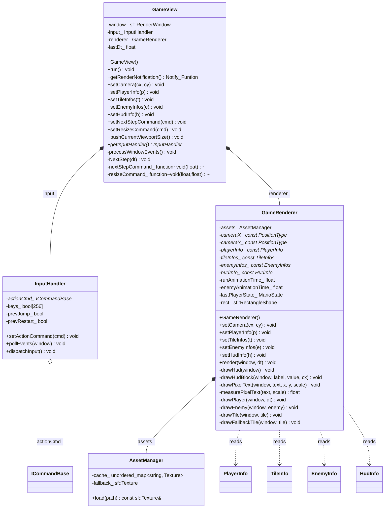
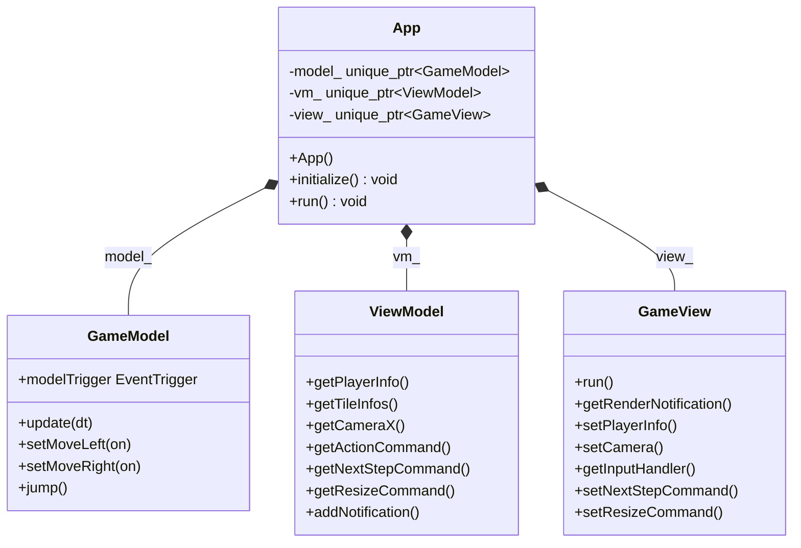

# 🍄 Mario

A classic Super Mario Bros. clone built with **C++17**, **SFML**, and the **MVVM** architectural pattern. The project features physics-based platforming, enemy AI, and a clean separation of concerns across four layers.

## Architecture Overview

The project follows **strict MVVM** with unidirectional data flow:

```
View ──input + tick──▶ ViewModel ──setMove*/update──▶ Model
View ◀──DTO + event─── ViewModel ◀──getter + event──── Model
```

**Iron rule**: `View → ViewModel → Model → common`. The View never includes model headers or calls model methods directly. The Model knows nothing about the ViewModel or View.

| Layer | Directory | Depends on | Responsibility |
|-------|-----------|------------|----------------|
| `common` | `src/common/` | nothing | Shared enums, type aliases, `EventTrigger` (observer), `ICommand` (command pattern), DTO structs |
| `model` | `src/model/` | `common` | Pure game logic: physics, collision, tile map parsing, enemy AI. No SFML. |
| `viewmodel` | `src/viewmodel/` | `common`, `model` | Mediator: drives model tick, caches model data as DTOs, fires render events, manages camera |
| `view` | `src/view/` | `common`, `viewmodel` | SFML window, input polling, rendering via `GameRenderer` + `AssetManager` |
| `app` | `src/app/` | all layers | Composition root: constructs Model → ViewModel → View and wires them together |

---

## Class Diagrams


### Model Layer



### ViewModel Layer



### View Layer



### App Layer (Composition Root)



---

## Data Flow

### Input (Downstream)

```
Keyboard → InputHandler::pollEvents → dispatchInput
  → ViewModel::act_Command(InputActionParameter)
    → InputCommand::exec
      → GameModel::setMoveLeft / setMoveRight / jump / reset
```

### Tick & Notification (Upstream)

```
GameView::run (fixed 60 Hz timestep)
  → ViewModel::tick(dt)
    → GameModel::update(dt)
      → Mario + Enemy physics
        → modelTrigger.fire(STATE_CHANGED)
          → ViewModel::onModelChanged
            → syncFromModel (model → DTOs)
              → vmTrigger.fire(RENDER_UPDATE)
                → GameView re-renders
```

### Render Pipeline

```
GameRenderer::render
  1. Draw tiles (GROUND brick texture, PIPE procedural, PLATFORM spritesheet)
  2. Draw enemies (2-frame animation, Direction-aware)
  3. Draw player (state-based animation: idle/run/jump/fall/dead)
  4. Draw HUD (pixel font, 7×5 dot matrix with shadow)
```

---

## Key Design Patterns

| Pattern | Implementation | Purpose |
|---------|---------------|---------|
| **Observer** | `EventTrigger` — generic callbacks via `Notify_Funtion` handles | Model → ViewModel → View event propagation |
| **Command** | `ICommandBase` / `ICommandParameter` / `TypeParameter<T>` / `InputCommand` | Decouple input from action execution |
| **Facade** | `GameModel` | Single entry point for ViewModel, hiding Mario + Enemy + TileMap internals |
| **DTO** | `PlayerInfo`, `TileInfo`, `EnemyInfo`, `HudInfo` | Cross-layer data transfer without exposing model internals |
| **Dependency Injection** | `App::initialize()` | Composition root wires all layers together |

---

## Project Structure

```
Mario/
├── src/
│   ├── common/           # Shared types, enums, EventTrigger, ICommand, DTOs
│   │   ├── EventId.h
│   │   ├── EventTrigger.h
│   │   ├── ICommand.h
│   │   └── Type.h
│   ├── model/            # Pure game logic (no SFML)
│   │   ├── Enemy.h       # header-only
│   │   ├── GameModel.h / .cpp
│   │   ├── Mario.h / .cpp
│   │   ├── PhysicsConfig.h
│   │   ├── Tile.h
│   │   └── TileMap.h / .cpp
│   ├── viewmodel/        # Mediator: model ↔ view
│   │   ├── ViewModel.h / .cpp
│   │   └── command/
│   │       └── Commands.h / .cpp
│   ├── view/             # SFML rendering & input
│   │   ├── View.h / .cpp
│   │   ├── input/
│   │   │   └── InputHandler.h / .cpp
│   │   └── renderer/
│   │       ├── AssetManager.h
│   │       └── GameRenderer.h / .cpp
│   └── app/              # Composition root
│       └── App.h / .cpp
├── tests/                # GTest unit tests
│   ├── common/
│   └── model/
├── picture/              # Game assets (textures, levels)
├── CMakeLists.txt
└── vcpkg.json
```

---

## Build & Run

### Prerequisites

- CMake 3.20+
- Ninja
- vcpkg (manifest mode — SFML and GTest are auto-fetched)

### Configure & Build

```powershell
# Configure (CMake + vcpkg manifest mode)
cmake -DCMAKE_MAKE_PROGRAM=ninja -G "Ninja Multi-Config" `
  -DCMAKE_TOOLCHAIN_FILE=<vcpkg-root>/scripts/buildsystems/vcpkg.cmake `
  -S . -B build

# Debug build
cmake --build build --config Debug

# Release build
cmake --build build --config Release

# Run
.\build\Debug\mario.exe
```

### Tests

```powershell
# Build test targets
cmake --build build --config Debug --target test_common test_model

# Run all tests
ctest --test-dir build -C Debug

# Run with filter
.\build\Debug\test_model.exe --gtest_filter=MarioTest.*
```

---

## Controls

| Key | Action |
|-----|--------|
| ← → / A D | Move left / right |
| Space / W / ↑ | Jump (edge-triggered, ground only) |
| R | Restart level |

## Game Rules

- **Lives**: Start with 3. Touching an enemy or running out of time = death (1.2s bounce animation → lose 1 life → level reset).
- **Time**: 300-second countdown, reaching zero kills Mario.
- **Stomp**: Landing on an enemy from above = stomp (+100 points + bounce). Side contact = Mario dies.
- **Respawn**: After death, the level resets (score/coins/enemies/time/position), only the lost life persists.

---

## License

This is an educational project for ZJU Learning.
