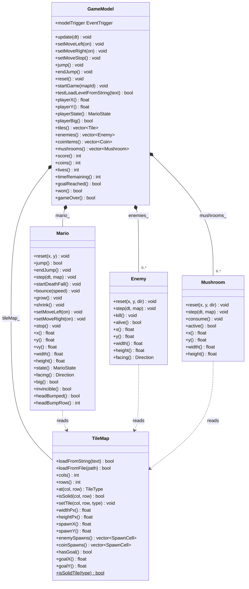
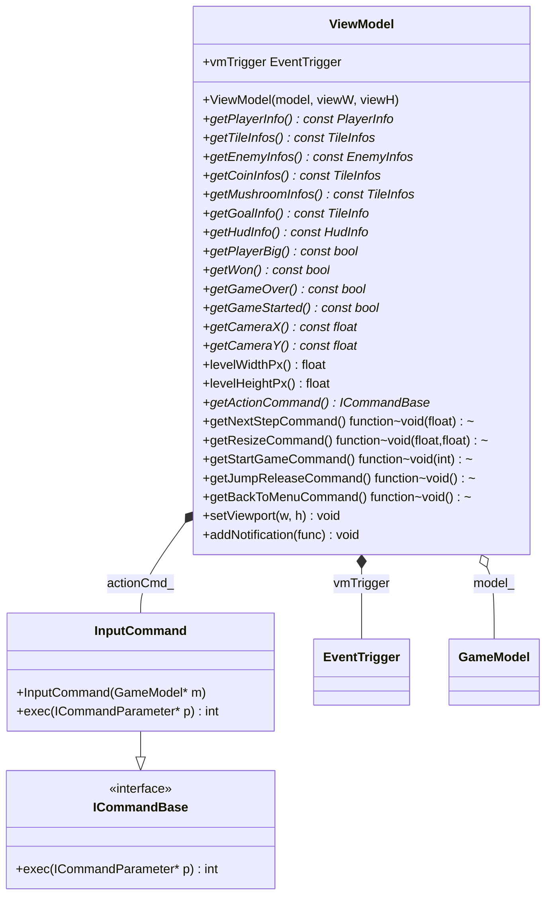
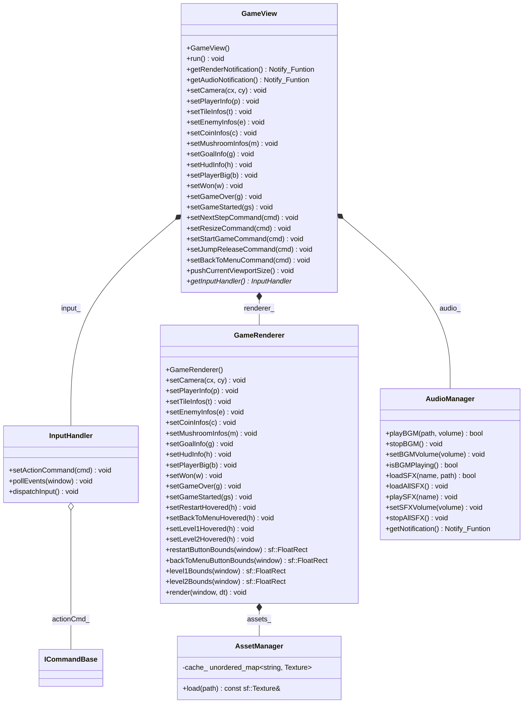
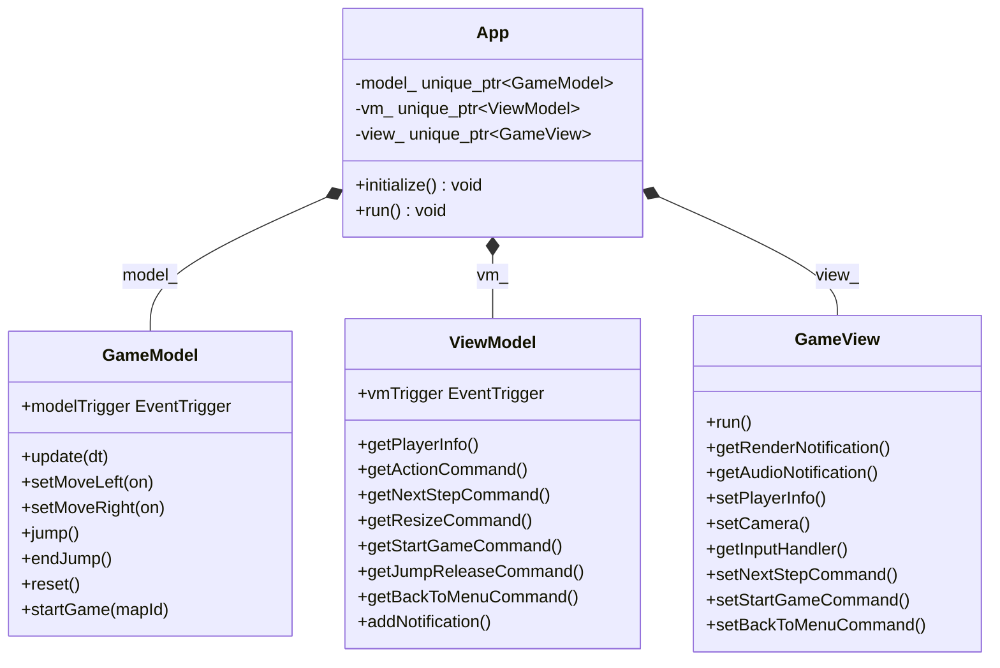

# 🍄 Mario

A classic Super Mario Bros. clone built with **C++17**, **SFML**, and the **MVVM** architectural pattern. The project features physics-based platforming, enemy AI, coin/mushroom items, audio (BGM + SFX), and a clean separation of concerns across four layers.

## Architecture Overview

The project follows **strict MVVM** with unidirectional data flow:

```
View ──input + tick──▶ ViewModel ──setMove*/update──▶ Model
View ◀──DTO + event─── ViewModel ◀──getter + event──── Model
```

**Iron rule**: `View → ViewModel → Model → common`. The View never includes model headers or calls model methods directly. The Model knows nothing about the ViewModel or View. All cross-layer data passes through ViewModel's DTOs.

| Layer | Directory | Depends on | Responsibility |
|-------|-----------|------------|----------------|
| `common` | `src/common/` | nothing | Shared enums, type aliases, `EventTrigger` (observer), `ICommand` (command pattern), DTO structs |
| `model` | `src/model/` | `common` | Pure game logic: physics, collision, tile map parsing, enemy AI, coin/mushroom items. No SFML. |
| `viewmodel` | `src/viewmodel/` | `common`, `model` | Mediator: drives model tick, caches model data as DTOs, fires render events, manages camera |
| `view` | `src/view/` | `common`, `viewmodel` | SFML window, input polling, rendering via `GameRenderer` + `AssetManager`, audio via `AudioManager` |
| `app` | `src/app/` | all layers | Composition root: constructs Model → ViewModel → View and wires them together |

---

## Class Diagrams

### Model Layer



### ViewModel Layer



### View Layer



### App Layer (Composition Root)



---

## Data Flow

### Start Menu (Downstream)

```
Launch → gameStarted=false → GameRenderer::drawStartMenu()
  → titlescreen.png + level 1/2 hot zones
    → Mouse click or key 1/2
      → startGameCommand_(mapId)
        → ViewModel::startGame(mapId)
          → GameModel::startGame(mapId)
            → load map/mapX.txt → gameStarted=true
```

### Input (Downstream)

```
Keyboard → InputHandler::pollEvents → dispatchInput
  → ViewModel::getActionCommand()→exec(InputActionParameter)
    → InputCommand::exec
      → GameModel::setMoveLeft / setMoveRight / jump / endJump / reset
```

### Tick & Notification (Upstream)

```
GameView::run (fixed 60 Hz timestep)
  → ViewModel::tick(dt)
    → GameModel::update(dt)
      → Mario + Enemy + Mushroom physics
      → Collision resolution (stomp / hurt / coin / mushroom / goal)
        → modelTrigger.fire(STATE_CHANGED) + fine-grained events
          → ViewModel::onModelChanged
            → syncFromModel (model → DTOs)
              → vmTrigger.fire(ev) — relays original event
                → GameView: render (STATE_CHANGED only)
                → AudioManager: play SFX (all events)
```

### Render Pipeline

```
GameRenderer::render
  [gameStarted=false] → drawStartMenu() → titlescreen.png + level hot zones
  [gameStarted=true]
    1. Tiles: GROUND/PIPE/QUESTION/BRICK procedural, PLATFORM textured
    2. Goal flagpole + castle (assets/castle.png)
    3. Coins: procedural rotating animation
    4. Mushrooms: procedural drawing
    5. Enemies: 2-frame texture animation, direction-aware
    6. Player: state-based sprite selection (idle/run/jump/fall/dead)
    → Switch to screen space
    7. HUD: 7×5 dot-matrix pixel font (SCORE/COINS/WORLD/TIME/LIVES)
    8. Win Overlay: YOU/WIN text with flag slide-down animation
    9. Game Over Overlay: GAME/OVER text with RESTART button
```

### Audio Pipeline

```
Model event → ViewModel relay → AudioManager::onEvent(ev)
  → event→SFX lookup (e.g. COIN_COLLECTED → "COIN_COLLECTED")
    → playSFX(name) → sf::Sound from preloaded buffer
  BGM: sf::Music streaming audio/bgm.ogg, looping
```

---

## Key Design Patterns

| Pattern | Implementation | Purpose |
|---------|---------------|---------|
| **Observer** | `EventTrigger` — generic callbacks via `Notify_Funtion` handles | Model → ViewModel → View event propagation; audio SFX triggers |
| **Command** | `ICommandBase` / `ICommandParameter` / `TypeParameter<T>` / `InputCommand` | Decouple input from action execution |
| **Facade** | `GameModel` | Single entry point for ViewModel, hiding Mario + Enemy + Mushroom + TileMap internals |
| **DTO** | `PlayerInfo`, `TileInfo`, `EnemyInfo`, `HudInfo` | Cross-layer data transfer without exposing model internals |
| **Dependency Injection** | `App::initialize()` | Composition root wires all layers together |

---

## Project Structure

```
Mario/
├── src/
│   ├── common/           # Shared types, enums, EventTrigger, ICommand, DTOs
│   │   ├── EventId.h
│   │   ├── EventTrigger.h
│   │   ├── ICommand.h
│   │   └── Type.h
│   ├── model/            # Pure game logic (no SFML)
│   │   ├── Coin.h        # header-only POD struct
│   │   ├── Enemy.h       # header-only
│   │   ├── GameModel.h / .cpp
│   │   ├── Mario.h / .cpp
│   │   ├── Mushroom.h    # header-only
│   │   ├── PhysicsConfig.h
│   │   ├── Tile.h        # header-only POD struct
│   │   └── TileMap.h / .cpp
│   ├── viewmodel/        # Mediator: model ↔ view
│   │   ├── ViewModel.h / .cpp
│   │   └── command/
│   │       └── Commands.h / .cpp
│   ├── view/             # SFML rendering, input & audio
│   │   ├── View.h / .cpp
│   │   ├── audio/
│   │   │   └── AudioManager.h / .cpp
│   │   ├── input/
│   │   │   └── InputHandler.h / .cpp
│   │   └── renderer/
│   │       ├── AssetManager.h
│   │       └── GameRenderer.h / .cpp
│   └── app/              # Composition root
│       └── App.h / .cpp
├── tests/                # GTest unit tests
│   ├── common/
│   └── model/
├── assets/               # UI textures (titlescreen, castle)
├── audio/                # BGM + SFX files
├── map/                  # Level files (map1.txt, map2.txt)
├── picture/              # Sprite sheets & tile textures
├── CMakeLists.txt
└── vcpkg.json
```

---

## Build & Run

### Prerequisites

- CMake 3.20+
- Ninja
- vcpkg (manifest mode — SFML and GTest are auto-fetched)

### Configure & Build

```powershell
# Configure (CMake + vcpkg manifest mode)
cmake -DCMAKE_MAKE_PROGRAM=ninja -G "Ninja Multi-Config" `
  -DCMAKE_TOOLCHAIN_FILE=<vcpkg-root>/scripts/buildsystems/vcpkg.cmake `
  -S . -B build

# Debug build
cmake --build build --config Debug

# Release build
cmake --build build --config Release

# Run
.\build\Debug\mario.exe
```

### Tests

```powershell
# Build test targets
cmake --build build --config Debug --target test_common test_model test_audio

# Run all tests
ctest --test-dir build -C Debug

# Run with filter
.\build\Debug\test_model.exe --gtest_filter=MarioTest.*
```

---

## Controls

| Key | Action |
|-----|--------|
| ← → / A D | Move left / right |
| Space / W / ↑ | Jump (edge-triggered, hold for higher jumps) |
| R | Restart level |

**Start Menu**:

| Key | Action |
|-----|--------|
| 1 / Numpad1 | Select level 1 |
| 2 / Numpad2 | Select level 2 |
| Mouse click | Click level hot zones on title screen |

## Game Rules

- **Lives**: Start with 3. Small Mario touching an enemy, falling into a pit, or time running out = death (1.2s bounce → lose 1 life → level reset). Big Mario hit → shrink to Small with 1.5s invincibility. Lives reach 0 → Game Over.
- **Time**: 300-second countdown, reaching zero kills Mario.
- **Stomp**: Landing on an enemy from above = stomp (+100 points + bounce). Side contact = Mario hurt.
- **Coins**: Collect for +200 points each.
- **Mushrooms**: Bump question blocks to spawn. Collect to grow from Small to Big (+1000 points).
- **Bricks**: Big Mario can smash bricks (+50 points). Small Mario only bumps them.
- **Goal**: Reach the flagpole to clear the level (+1000 points).
- **Respawn**: After death, the level resets (score/coins/enemies/mushrooms/time/position), only the lost life persists.

---

## License

This is an educational project for ZJU Learning.
