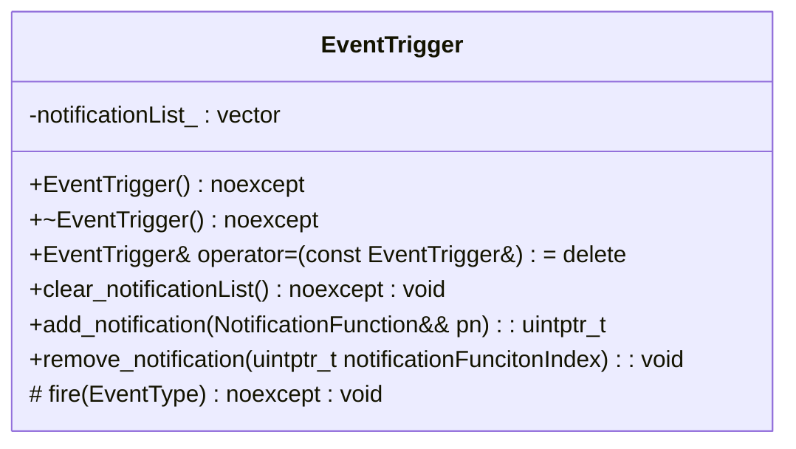

# Mario
C++短学期大作业：复刻马里奥

## 命名说明

1. 类名使用了大驼峰命名
2. 变量名使用了小驼峰命名
3. 私有成员变量使用了下划线后缀

## 接口说明

需要进行`call_back`的类需要使用下面的类作为数据成员, 用来维护回调函数列表进行回调
回调函数的形式为`std::function<void(EventType)>`, 这是一个函数指针传入一个`eventId`(类型为`EventType`)进行回调
<!-- 这里的回调接口尚不明确, 暂时先这样写 -->

## 项目声明

1. 顶层的`Mario/CMakeLists.txt`用于引入外部库, 需要同步修改`vcpkg.*`的文件, 以及`src/precompile.h`进行提前编译加快编译速度.
2. `src/CMakeLists.txt`为构建项目声明文件, 包括`cpp`文件, 头文件路径
   - 注意将写好的`cpp`加入到这里的`add_executable`中
   - 因此引入项目内部的头文件只需要相对`src/`目录的路径, 各层头文件中均有示例
   - 项目需要通过`cmake`构建, 单条`c++`命令难以构建, 请确保能构建输出看到`Hello, Mario!`.
3. 请务必使用`mermaid`图声明类的结构, 后续可以考虑怎么构建类之间的关系图

- [ ] 尚未对于最终构建的可执行文件的路径进行说明 <!-- TODO: 统一build路径 -->
- [ ] 尚未引入单元测试模块

## 代码相关

- [ ] 尚不明确是否需要命令接口
- [ ] 尚未明确事件通知(notification)的参数, 以及事件类的定义

## 补充

我注意到这有一个完成度较高但是代码依托的[项目](https://github.com/SR-KrAu/SuperMario), 或许里面的美术资源会有帮助.
